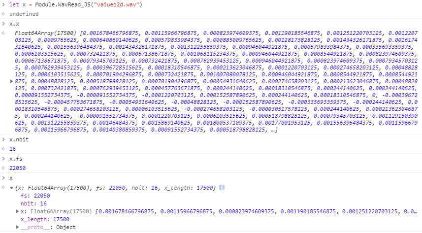
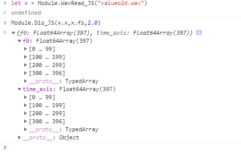
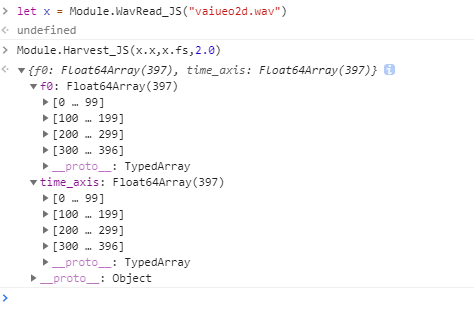

<p align="center"></p>
<h1 align="center">World.JS</h1>
<p align="center">A JavaScript Wrapper for World Vocoder Powered by Emscripten</p>
### About World.JS

World.JS is A JavaScript Wrapper for World Vocoder Powered by Emscripten.

You can use World Vocoder in your Browser,Node or Electron app and many more.

####  About Emscripten
Emscripten is a toolchain for compiling to asm.js and WebAssembly, built using LLVM, that lets you run C and C++ on the web at near-native speed without plugins.
- Fast as near-native speed.
- Easy to use.
- Powerful

#### About World

Morise's World Vocoder is a fast and high-quality vocoder. World Vocoder parameterizes speech into three components:

1. Pitch (fundamental frequency, F0) contour
2. Harmonic spectral envelope
3. Aperiodic spectral envelope (relative to the harmonic spectral envelope)

For more information, please visit [Morise's World repository](https://github.com/mmorise/World) and the [official website of World Vocoder](http://ml.cs.yamanashi.ac.jp/world/english/)

### API

##### WavRead_JS

> .wav input/output functions

```html
<script src="WorldJS.js"></script> 

<script>
    let x = Module.WavRead_JS("vaiueo2d.wav");
    console.log(x);
    console.log(x.x);
    console.log(x.fs);
    console.log(x.nbit);
    console.log(x.x_length);
</script>
```



##### DIO_JS

> F0 estimation based on DIO (Distributed Inline-filter Operation).

```html
<script src="WorldJS.js"></script> 

<script>
    let x = Module.WavRead_JS("vaiueo2d.wav");
	let f0 = Module.Dio_JS(x.x,x.fs,2.0);
    console.log(x);
    console.log(f0);
</script>
```


##### Harvest_JS

> F0 estimation based on Harvest.

```
<script src="WorldJS.js"></script> 

<script>
    let x = Module.WavRead_JS("vaiueo2d.wav");
    let f0 = Module.Harvest_JS(x.x,x.fs,2.0);
    console.log(x);
    console.log(f0);
</script>
```



### Build World.JS

##### Before Build

You must install these software in advance:

- [Cmake](https://cmake.org/)
- [Python2.7 environment](https://www.python.org/)
- [Emscripten SDK](https://emscripten.org/)
- [Node](https://nodejs.org/)
- Software development tool chain like `make` `gcc` etc.

##### Clone Files

```bash
git clone https://github.com/GloomyGhost-MosquitoSeal/World.JS.git
git submodule init
git submodule update
```

##### Set emsdk

Edit it in `build.py` and change the path into your own.

```python
"DCMAKE_TOOLCHAIN_FILE=D:\\Emscripten\\emscripten\\1.35.0\\cmake\\Modules\\Platform\\Emscripten.cmake"
```

##### Run build script

Before run it, make sure `vaiueo2d.wav` is existence in the build folder or change the `CMakeLists.txt` and delete the `preload-file`

```bash
python build.py
```

And the file will show in `build/WorldJS.data` `build/WorldJS.js`  `build/WorldJS.js.mem`

### File Tree 

```Text
├─build
├─example
│  └─html
├─lib
│  └─WorldCmake
│      └─World
├─src
│  └─WorldJS
├─test
└─tools
    └─third_party
        └─emscripten
```


<details>
<summary>Expand View all directory trees</summary>
<pre><code>.
├─.vscode
├─build
├─example
│  └─html
├─lib
│  └─WorldCmake
│      └─World
│          ├─build
│          ├─doc
│          ├─examples
│          │  ├─analysis_synthesis
│          │  ├─codec_test
│          │  └─parameter_io
│          ├─src
│          │  └─world
│          ├─test
│          ├─tools
│          └─visualstudio
│              └─win
├─src
│  └─WorldJS
├─test
└─tools
    └─third_party
        └─emscripten
            ├─.circleci
            ├─cmake
            │  └─Modules
            │      └─Platform
            ├─docs
            ├─media
            ├─site
            │  ├─build
            │  │  └─text
            │  │      └─docs
            │  │          └─tools_reference
            │  └─source
            │      ├─docs
            │      │  ├─api_reference
            │      │  ├─building_from_source
            │      │  ├─compiling
            │      │  ├─contributing
            │      │  ├─debugging
            │      │  ├─getting_started
            │      │  ├─introducing_emscripten
            │      │  ├─optimizing
            │      │  ├─porting
            │      │  │  ├─connecting_cpp_and_javascript
            │      │  │  ├─files
            │      │  │  ├─guidelines
            │      │  │  └─multimedia_and_graphics
            │      │  ├─site
            │      │  └─tools_reference
            │      ├─_static
            │      └─_themes
            │          └─emscripten_sphinx_rtd_theme
            │              └─static
            │                  ├─css
            │                  ├─fonts
            │                  └─js
            ├─src
            │  └─embind
            ├─system
            │  ├─bin
            │  ├─include
            │  │  ├─AL
            │  │  ├─compat
            │  │  │  └─sys
            │  │  ├─EGL
            │  │  ├─emscripten
            │  │  ├─GL
            │  │  ├─GLES
            │  │  ├─GLES2
            │  │  ├─GLES3
            │  │  ├─GLFW
            │  │  ├─KHR
            │  │  ├─libc
            │  │  │  ├─arpa
            │  │  │  ├─net
            │  │  │  ├─netinet
            │  │  │  ├─netpacket
            │  │  │  ├─scsi
            │  │  │  └─sys
            │  │  ├─libcxx
            │  │  │  ├─experimental
            │  │  │  ├─ext
            │  │  │  └─support
            │  │  │      ├─android
            │  │  │      ├─fuchsia
            │  │  │      ├─ibm
            │  │  │      ├─musl
            │  │  │      ├─newlib
            │  │  │      ├─solaris
            │  │  │      ├─win32
            │  │  │      └─xlocale
            │  │  ├─SDL
            │  │  ├─SSE
            │  │  ├─uuid
            │  │  └─X11
            │  │      └─extensions
            │  ├─lib
            │  │  ├─compiler-rt
            │  │  │  └─lib
            │  │  │      └─builtins
            │  │  ├─embind
            │  │  ├─fetch
            │  │  ├─html5
            │  │  ├─libc
            │  │  │  └─musl
            │  │  │      ├─arch
            │  │  │      │  └─emscripten
            │  │  │      │      └─bits
            │  │  │      ├─dist
            │  │  │      ├─ldso
            │  │  │      └─src
            │  │  │          ├─aio
            │  │  │          ├─compat-emscripten
            │  │  │          ├─complex
            │  │  │          ├─conf
            │  │  │          ├─crypt
            │  │  │          ├─ctype
            │  │  │          ├─dirent
            │  │  │          ├─env
            │  │  │          ├─errno
            │  │  │          ├─exit
            │  │  │          ├─fcntl
            │  │  │          ├─fenv
            │  │  │          │  ├─armebhf
            │  │  │          │  ├─armhf
            │  │  │          │  ├─mips-sf
            │  │  │          │  ├─mipsel-sf
            │  │  │          │  ├─sh-nofpu
            │  │  │          │  └─sheb-nofpu
            │  │  │          ├─internal
            │  │  │          ├─ipc
            │  │  │          ├─ldso
            │  │  │          ├─legacy
            │  │  │          ├─linux
            │  │  │          ├─locale
            │  │  │          ├─math
            │  │  │          │  ├─armebhf
            │  │  │          │  └─armhf
            │  │  │          ├─misc
            │  │  │          ├─mman
            │  │  │          ├─mq
            │  │  │          ├─multibyte
            │  │  │          ├─network
            │  │  │          ├─passwd
            │  │  │          ├─prng
            │  │  │          ├─process
            │  │  │          ├─regex
            │  │  │          ├─sched
            │  │  │          ├─search
            │  │  │          ├─select
            │  │  │          ├─setjmp
            │  │  │          │  ├─mips-sf
            │  │  │          │  ├─mipsel-sf
            │  │  │          │  ├─sh-nofpu
            │  │  │          │  └─sheb-nofpu
            │  │  │          ├─signal
            │  │  │          ├─stat
            │  │  │          ├─stdio
            │  │  │          ├─stdlib
            │  │  │          ├─string
            │  │  │          │  ├─armel
            │  │  │          │  └─armhf
            │  │  │          ├─temp
            │  │  │          ├─termios
            │  │  │          ├─thread
            │  │  │          ├─time
            │  │  │          └─unistd
            │  │  ├─libcxx
            │  │  │  ├─experimental
            │  │  │  │  └─filesystem
            │  │  │  ├─include
            │  │  │  └─support
            │  │  │      ├─runtime
            │  │  │      ├─solaris
            │  │  │      └─win32
            │  │  ├─libcxxabi
            │  │  │  ├─include
            │  │  │  │  └─mach-o
            │  │  │  ├─lib
            │  │  │  └─src
            │  │  │      └─Unwind
            │  │  ├─pkgconfig
            │  │  └─pthread
            │  └─local
            │      └─include
            ├─tests
            │  ├─asmfs
            │  ├─box2d
            │  │  ├─Box2D
            │  │  │  ├─Collision
            │  │  │  │  └─Shapes
            │  │  │  ├─Common
            │  │  │  ├─Dynamics
            │  │  │  │  ├─Contacts
            │  │  │  │  └─Joints
            │  │  │  └─Rope
            │  │  ├─Build
            │  │  │  ├─vs2010
            │  │  │  └─xcode4
            │  │  │      └─Box2D.xcodeproj
            │  │  │          └─project.xcworkspace
            │  │  ├─freeglut
            │  │  ├─glui
            │  │  ├─HelloWorld
            │  │  └─Testbed
            │  │      ├─Framework
            │  │      └─Tests
            │  ├─browser
            │  ├─bullet
            │  │  ├─Demos
            │  │  │  ├─Benchmarks
            │  │  │  └─HelloWorld
            │  │  ├─Extras
            │  │  │  ├─ConvexDecomposition
            │  │  │  └─glui
            │  │  │      └─GL
            │  │  ├─lib
            │  │  └─src
            │  │      ├─BulletCollision
            │  │      │  ├─BroadphaseCollision
            │  │      │  ├─CollisionDispatch
            │  │      │  ├─CollisionShapes
            │  │      │  ├─Gimpact
            │  │      │  ├─ibmsdk
            │  │      │  └─NarrowPhaseCollision
            │  │      ├─BulletDynamics
            │  │      │  ├─Character
            │  │      │  ├─ConstraintSolver
            │  │      │  ├─Dynamics
            │  │      │  ├─ibmsdk
            │  │      │  └─Vehicle
            │  │      ├─BulletMultiThreaded
            │  │      │  ├─GpuSoftBodySolvers
            │  │      │  │  ├─CPU
            │  │      │  │  ├─DX11
            │  │      │  │  │  └─HLSL
            │  │      │  │  └─OpenCL
            │  │      │  │      ├─AMD
            │  │      │  │      ├─Apple
            │  │      │  │      ├─MiniCL
            │  │      │  │      ├─NVidia
            │  │      │  │      ├─OpenCLC
            │  │      │  │      └─OpenCLC10
            │  │      │  ├─SpuNarrowPhaseCollisionTask
            │  │      │  └─SpuSampleTask
            │  │      ├─BulletSoftBody
            │  │      ├─ibmsdk
            │  │      ├─LinearMath
            │  │      │  └─ibmsdk
            │  │      ├─MiniCL
            │  │      │  └─MiniCLTask
            │  │      └─vectormath
            │  │          ├─scalar
            │  │          └─sse
            │  ├─cases
            │  ├─cmake
            │  │  ├─cmake_with_emval
            │  │  ├─cpp_lib
            │  │  ├─emscripten_version
            │  │  ├─static_lib
            │  │  ├─stdproperty
            │  │  ├─target_html
            │  │  ├─target_js
            │  │  └─target_library
            │  ├─core
            │  ├─cstdio
            │  ├─ctype
            │  ├─cube2hash
            │  ├─cubescript
            │  ├─debugger
            │  ├─dirent
            │  ├─embind
            │  ├─emmake
            │  ├─emscripten_log
            │  ├─enet
            │  │  ├─docs
            │  │  ├─include
            │  │  │  └─enet
            │  │  └─m4
            │  ├─env
            │  ├─fcntl
            │  ├─fcntl-misc
            │  ├─fcntl-open
            │  ├─fetch
            │  ├─filesystem
            │  ├─freealut
            │  │  ├─admin
            │  │  │  ├─autotools
            │  │  │  │  └─m4
            │  │  │  ├─CMakeModules
            │  │  │  ├─pkgconfig
            │  │  │  ├─RPM
            │  │  │  ├─VisualStudio6
            │  │  │  │  ├─alut
            │  │  │  │  ├─hello_world
            │  │  │  │  └─playfile
            │  │  │  └─VisualStudioDotNET
            │  │  │      ├─alut
            │  │  │      ├─hello_world
            │  │  │      └─playfile
            │  │  ├─doc
            │  │  ├─examples
            │  │  ├─include
            │  │  │  └─AL
            │  │  ├─src
            │  │  └─test_suite
            │  ├─freetype
            │  │  ├─builds
            │  │  │  └─unix
            │  │  ├─docs
            │  │  ├─include
            │  │  │  └─freetype
            │  │  │      ├─config
            │  │  │      └─internal
            │  │  │          └─services
            │  │  ├─objs
            │  │  └─src
            │  │      ├─autofit
            │  │      ├─base
            │  │      ├─bdf
            │  │      ├─cache
            │  │      ├─cff
            │  │      ├─cid
            │  │      ├─gxvalid
            │  │      ├─gzip
            │  │      ├─lzw
            │  │      ├─otvalid
            │  │      ├─pcf
            │  │      ├─pfr
            │  │      ├─psaux
            │  │      ├─pshinter
            │  │      ├─psnames
            │  │      ├─raster
            │  │      ├─sfnt
            │  │      ├─smooth
            │  │      ├─tools
            │  │      │  ├─docmaker
            │  │      │  └─ftrandom
            │  │      ├─truetype
            │  │      ├─type1
            │  │      ├─type42
            │  │      └─winfonts
            │  ├─fs
            │  ├─fuzz
            │  │  └─include
            │  ├─glbook
            │  │  ├─Chapter_10
            │  │  │  └─MultiTexture
            │  │  ├─Chapter_11
            │  │  │  ├─Multisample
            │  │  │  └─Stencil_Test
            │  │  ├─Chapter_13
            │  │  │  └─ParticleSystem
            │  │  ├─Chapter_15
            │  │  │  └─Hello_Triangle_KD
            │  │  ├─Chapter_2
            │  │  │  └─Hello_Triangle
            │  │  ├─Chapter_8
            │  │  │  └─Simple_VertexShader
            │  │  ├─Chapter_9
            │  │  │  ├─MipMap2D
            │  │  │  ├─Simple_Texture2D
            │  │  │  ├─Simple_TextureCubemap
            │  │  │  └─TextureWrap
            │  │  └─Common
            │  ├─hyperbolic
            │  ├─include_test
            │  ├─interop
            │  ├─langinfo
            │  ├─lua
            │  │  ├─doc
            │  │  └─src
            │  ├─lzma
            │  │  └─lzma
            │  ├─math
            │  ├─module
            │  ├─Module-exports
            │  ├─msvc10
            │  ├─nbody-java
            │  ├─netinet
            │  ├─openjpeg
            │  │  ├─CMake
            │  │  ├─codec
            │  │  ├─common
            │  │  ├─doc
            │  │  │  └─man
            │  │  │      ├─man1
            │  │  │      └─man3
            │  │  └─libopenjpeg
            │  ├─optimizer
            │  ├─other
            │  │  ├─fd_closed
            │  │  ├─ioctl
            │  │  │  └─window_size
            │  │  ├─malloc_implicit
            │  │  ├─unlink
            │  │  ├─wasm_sourcemap
            │  │  └─wasm_sourcemap_dead
            │  ├─parseInt
            │  ├─poppler
            │  │  ├─cmake
            │  │  │  └─modules
            │  │  ├─cpp
            │  │  │  └─tests
            │  │  ├─fofi
            │  │  ├─fontconfig
            │  │  ├─glib
            │  │  │  ├─demo
            │  │  │  └─reference
            │  │  │      └─html
            │  │  ├─goo
            │  │  ├─m4
            │  │  ├─poppler
            │  │  ├─qt
            │  │  ├─qt4
            │  │  │  ├─demos
            │  │  │  ├─src
            │  │  │  └─tests
            │  │  ├─splash
            │  │  ├─test
            │  │  └─utils
            │  ├─printf
            │  ├─pthread
            │  ├─python
            │  ├─qsort
            │  ├─return64bit
            │  ├─scons
            │  ├─sockets
            │  │  ├─p2p
            │  │  │  ├─broker
            │  │  │  └─client
            │  │  └─ws
            │  │      └─lib
            │  ├─sounds
            │  ├─sqlite
            │  ├─stat
            │  ├─stdio
            │  ├─systypes
            │  ├─termios
            │  ├─test_whole_archive
            │  ├─time
            │  ├─unistd
            │  ├─utime
            │  ├─uuid
            │  ├─va_arg
            │  ├─wasm
            │  ├─webidl
            │  └─zlib
            ├─third_party
            │  ├─closure-compiler
            │  │  ├─browser-externs
            │  │  └─node-externs
            │  ├─jni
            │  ├─lzma.js
            │  │  └─lzip
            │  ├─ply
            │  │  ├─doc
            │  │  ├─example
            │  │  │  ├─ansic
            │  │  │  ├─BASIC
            │  │  │  ├─calc
            │  │  │  ├─calcdebug
            │  │  │  ├─classcalc
            │  │  │  ├─closurecalc
            │  │  │  ├─GardenSnake
            │  │  │  ├─hedit
            │  │  │  ├─newclasscalc
            │  │  │  ├─optcalc
            │  │  │  ├─unicalc
            │  │  │  └─yply
            │  │  ├─ply
            │  │  └─test
            │  └─websockify
            │      ├─docs
            │      ├─include
            │      │  └─web-socket-js
            │      ├─other
            │      │  └─js
            │      ├─tests
            │      ├─websockify
            │      └─Windows
            │          └─noVNC Websocket Service Project
            │              └─Properties
            └─tools
                ├─debug
                ├─eliminator
                │  └─node_modules
                │      ├─.bin
                │      └─uglify-js
                │          ├─bin
                │          ├─lib
                │          ├─test
                │          │  └─unit
                │          │      └─compress
                │          │          ├─expected
                │          │          └─test
                │          └─tmp
                ├─experimental
                ├─node_modules
                │  └─source-map
                │      └─lib
                ├─optimizer
                ├─ports
                ├─scons
                │  └─site_scons
                │      └─site_tools
                │          └─emscripten
                └─source-maps
</pre></code>


