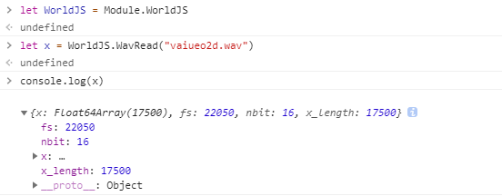
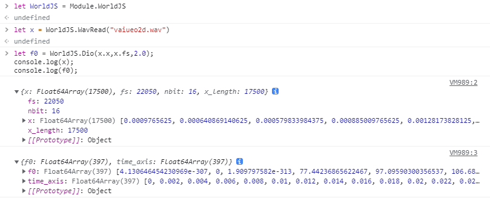
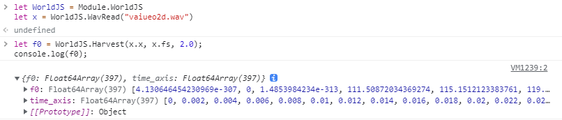
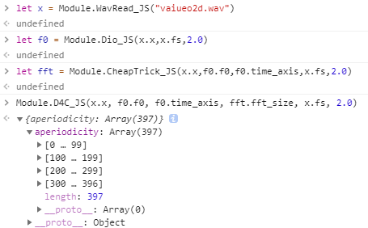

<p align="center"></p>
<h1 align="center">World.JS</h1>
<p align="center">World.JS 是由 Emscripten 所编译的 World Vocoder 的 JavaScript 版本。</p>
<p align="center">    </p>


## 关于 World.JS

World.JS 是 World Vocoder 的 JavaScript 版本，其通过 Emscripten 构建。您可以在浏览器、NodeJS、Electron 应用程序等任何可以使用普通 JavaScript 代码的地方使用它。

## 关于 Emscripten
Emscripten 是 Mozilla 的开发人员 Alon Zakai 所开发的一个独特 LLVM 后端，可以将 LLVM 中间码编译成 JavaScript ，大大简化了现有代码在 Web 时代的重用。

## 关于 World

World Vocoder 是由 Morise 所开发的一个高速而高质量的 Vocoder (声码器)。 可用于分析语音音频的参数等。例如：

1. 音高（基频）推断
2. 谐波频谱包络推断
3. 非周期性频谱包络（相对于谐波频谱包络）的推断

!> 更多信息，请访问 [World 官方仓库](https://github.com/mmorise/World) 或者 [World Vocoder 的官方网站](http://www.kisc.meiji.ac.jp/~mmorise/world/)

## 持续集成编译情况
| appveyor master 分支 | appveyor 最新提交 | GitHub Action 最新提交 |
|---|---|---|
|[](https://ci.appveyor.com/project/GloomyGhost-MosquitoCoil/world-js/branch/master)|[](https://ci.appveyor.com/project/GloomyGhost-MosquitoCoil/world-js)||

## API
```
World 所提供的原生 API:
- [x] WavRead_JS             # 读取 .wav 文件
- [x] DIO_JS                 # 基于DIO（分布式串联滤波器操作）的基频推断。
- [x] Harvest_JS             # 基于 Harvest 的基频推断。
- [x] DisplayInformation     # 输出信息到控制台
- [x] CheapTrick_JS          # 基于CheapTrick思想的频谱包络推断。
- [x] D4C_JS                 # 基于D4C想法的非周期性频谱包络推断。
- [X] Synthesis_JS           # 基于以上参数合成音频
- [x] WavWrite_JS            # 输出 .wav 文件

World.JS 提供的接口:
- [x] Wav2World              # 将 .wav 分析出 World 的全部参数
- [x] DisplayInformationVal  # 直接将分析得到的音频信息显示出来
- [X] GetInformation         # 输出 HTML 模式的分析信息
- [ ] WavInJS                # 使用原生 JavaScript 读取音频
```

## 使用方法

### 示例

#### WavRead_JS

```html
<script src="WorldJS.js"></script> 

<script>
    let x = Module.WavRead_JS("vaiueo2d.wav");
    console.log(x);
    console.log(x.x);
    console.log(x.fs);
    console.log(x.nbit);
    console.log(x.x_length);
</script>
```



#### DIO_JS

```html
<script src="WorldJS.js"></script> 

<script>
    let x = Module.WavRead_JS("vaiueo2d.wav");
    let f0 = Module.Dio_JS(x.x,x.fs,2.0);
    console.log(x);
    console.log(f0);
</script>
```


#### Harvest_JS

```html
<script src="WorldJS.js"></script> 

<script>
    let x = Module.WavRead_JS("vaiueo2d.wav");
    let f0 = Module.Harvest_JS(x.x,x.fs,2.0);
    console.log(x);
    console.log(f0);
</script>
```



#### DisplayInformation

```html
<script src="WorldJS.js"></script> 

<script>
    let x = Module.WavRead_JS("vaiueo2d.wav");
    Module.DisplayInformation(x.fs, x.nbit, x.x_length);
</script>
```

#### CheapTrick_JS

```html
<script src="WorldJS.js"></script> 

<script>
    let x = Module.WavRead_JS("vaiueo2d.wav");
    let f0 = Module.Dio_JS(x.x, x.fs, 2.0);
    Module.CheapTrick_JS(x.x, f0.f0, f0.time_axis, x.fs, 2.0);
</script>
```


#### D4C_JS

```html
<script src="WorldJS.js"></script> 

<script>
    let x = Module.WavRead_JS("vaiueo2d.wav");
    let f0 = Module.Dio_JS(x.x, x.fs, 2.0);
    let sp = Module.CheapTrick_JS(x.x, f0.f0, f0.time_axis, x.fs, 2.0);
    Module.D4C_JS(x.x, f0.f0, f0.time_axis, sp.fft_size, x.fs, 2.0);
</script>
```



#### Synthesis_JS

```html
<script src="WorldJS.js"></script> 

<script>
    let x = Module.WavRead_JS("vaiueo2d.wav");
    let f0 = Module.Dio_JS(x.x, x.fs, 2.0);
    let sp = Module.CheapTrick_JS(x.x, f0.f0, f0.time_axis, x.fs, 2.0);
    let ap = Module.D4C_JS(x.x, f0.f0, f0.time_axis, sp.fft_size, x.fs, 2.0);
    Module.Synthesis_JS(f0.f0, sp.spectral, ap.aperiodicity, sp.fft_size, x.fs, 2.0)
</script>
```

#### WavWrite_JS

```html
<script src="WorldJS.js"></script> 
<script>
    let x = Module.WavRead_JS("vaiueo2d.wav");
    Module.WavWrite_JS(x.x, x.fs, x.nbit, "out.wav")
</script>
```


#### Wav2World

```html
<script src="WorldJS.js"></script> 
<script>
    Module.Wav2World("vaiueo2d.wav");
</script>
```


### 编译 World.JS

#### 编译演示

这个演示片段展示了如何在 Linux 系统中编译 World.JS

<script id="asciicast-388188" src="https://asciinema.org/a/388188.js" async></script>

##### 编译前的准备

建议在编译前准备好这些工具环境配置

- [CMake](https://cmake.org/)
- [Python3 environment](https://www.python.org/)
- [Emscripten SDK](https://emscripten.org/)
- [Node](https://nodejs.org/)
- [VSCode](https://code.visualstudio.com/)
  - [VSCode extension: CMake Tools](https://marketplace.visualstudio.com/items?itemName=vector-of-bool.cmake-tools)
- 基本的编译工具，例如 `make` `gcc` 等工具

##### 拉取代码

```bash
git clone https://github.com/YuzukiTsuru/World.JS.git
git submodule init
git submodule update
```

##### 设置编译工具链

###### VSCode
在 `.vscode/settings.json` 中编辑配置，设置工具链文件路径

```yaml
"cmake.configureArgs": ["-DCMAKE_TOOLCHAIN_FILE=path/to/Emscripten.cmake"]
```
###### CMake

预编译时使用 `CMAKE_TOOLCHAIN_FILE` 参数定义工具链

例如：
```bash
mkdir build && cd build
cmake -DCMAKE_TOOLCHAIN_FILE=the/path/to/Emscripten.cmake ..
```

##### 运行编译命令

!> World.JS 的 Debug 版本在构建的时候会将测试音频文件 `vaiue.wav` 

###### VSCode

点击编译按钮

###### CMake

使用 `make` 命令进行编译

```bash
cd build
make
```

### 常见问题

##### Uncaught could not load memory initializer

```
Access to XMLHttpRequest at 'file:///World.JS/test/WorldJS.data' from origin 'null' has been blocked by CORS policy: Cross origin requests are only supported for protocol schemes: http, data, chrome, chrome-extension, https.
WorldJS.js:15 Uncaught could not load memory initializer WorldJS.js.mem
```
不幸的是，某些浏览器（包括*Chrome*，*Safari*和*Internet Explorer*）目前并不支持`file://` 作为 XHRrequests，导致无法加载 HTML 所需的额外文件（例如 `.mem` 文件， 或打包文件 `.data`。 对于这些浏览器，您需要使用网络服务器来提供文件。 最简单的方法是使用 Python  提供的 HTTPServer（在当前目录中执行python -m SimpleHTTPServer（Python2）python -m http.server（python3），然后打开http://localhost:8000`）。  emscripten还提供了“ emrun”来运行此类代码。 文档如下：
[Running HTML files with emrun](https://emscripten.org/docs/compiling/Running-html-files-with-emrun.html)

### 文件系统开发

目前 World.JS 的文件系统是基于 emscripten 的，将来会加入自己的文件系统。目前请使用 emscripten 的文件系统提供文件。

!> 不可直接进行诸如 `Module.WavRead_JS("/home/my/vaiueo2d.wav");` 这样的文件导入，目前还未解决文件系统的导入问题。

相关文档：

[https://emscripten.org/docs/porting/files/index.html](https://emscripten.org/docs/porting/files/index.html)

## 参考资料

[1] M. Morise, F. Yokomori, and K. Ozawa: WORLD: a vocoder-based high-quality speech synthesis system for real-time applications, IEICE transactions on information and systems, vol. E99-D, no. 7, pp. 1877-1884, 2016.
[2] M. Morise: D4C, a band-aperiodicity estimator for high-quality speech synthesis, Speech Communication, vol. 84, pp. 57-65, Nov. 2016. http://www.sciencedirect.com/science/article/pii/S0167639316300413

`关于 CheapTrick`

[3] M. Morise: CheapTrick, a spectral envelope estimator for high-quality speech synthesis, Speech Communication, vol. 67, pp. 1-7, March 2015. http://www.sciencedirect.com/science/article/pii/S0167639314000697
[4] M. Morise: Error evaluation of an F0-adaptive spectral envelope estimator in robustness against the additive noise and F0 error, IEICE transactions on information and systems, vol. E98-D, no. 7, pp. 1405-1408, July 2015.

`关于 Dio`

[5] M. Morise, H. Kawahara and H. Katayose: Fast and reliable F0 estimation method based on the period extraction of vocal fold vibration of singing voice and speech, AES 35th International Conference, CD-ROM Proceeding, Feb. 2009.

`关于 Harvest`

[6] M. Morise: Harvest: A high-performance fundamental frequency estimator from speech signals, in Proc. INTERSPEECH 2017, pp. 2321–2325, 2017. http://www.isca-speech.org/archive/Interspeech_2017/abstracts/0068.html

`关于频谱包络`

[7] M. Morise, G. Miyashita and K. Ozawa: Low-dimensional representation of spectral envelope without deterioration for full-band speech analysis/synthesis system, in Proc. INTERSPEECH 2017, pp. 409-413, 2017. http://www.isca-speech.org/archive/Interspeech_2017/abstracts/0067.html

`此论文证明当前版本的 WORLD 在重新合成语音的音质方面优于同类声码器。本文还包括最新版本中使用的 D4C 与 LoveTrain 中的详细信息。`

[8] M. Morise and Y. Watanabe: Sound quality comparison among high-quality vocoders by using re-synthesized speech, Acoust. Sci. & Tech., vol. 39, no. 3, pp. 263-265, May 2018. https://www.jstage.jst.go.jp/article/ast/39/3/39_E1779/_article/-char/en
